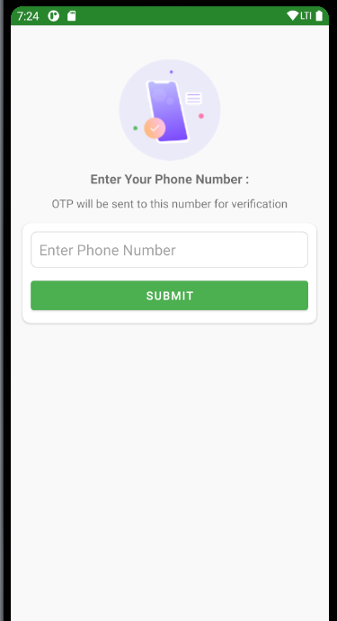

# ChatApp
An Android Chat Application developed using Java, Firebase and various Java Libraries

Technologies Used - 
1. Java
2. Firebase Realtime Database
3. Firebase Storage
4. Firebase Authentication (Phone Auth)

External Libraries Used - 
1. OTP View: https://github.com/mukeshsolanki/android-otpview-pinview
2. Glide Image Processing: https://github.com/bumptech/glide
3. Circular Image View: https://github.com/hdodenhof/CircleImageView
4. Reactions View: https://github.com/pgreze/android-reactions

Current Features -
1) Individual Chat Functionality along with ability to send Images
2) Add reactions for Individual Chats
4) Realtime Status update for User i.e. Online, Offline, Typing
3) Phone Auth using Firebase for Login

Upcoming Features -
1) Support for Group Chat
2) Setting up Stories
3) Adding Profile Page to change Settings
4) Block a User

Screenshots -
1. 
2. 
3. 
4. 

